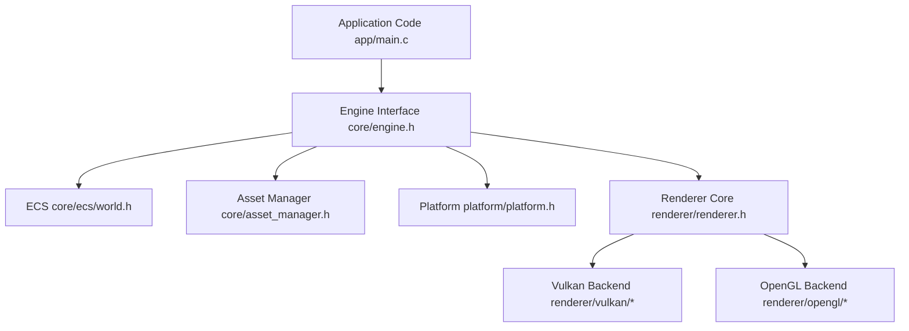

# 🌌 C23 Game Engine

A lightweight, modular, and high-performance 2D game engine built from scratch in C. This project features a custom Entity Component System (ECS), a Vulkan graphics renderer, a Lua 5.4 scripting host, and an integrated Dear ImGui-based editor workspace.

> [!NOTE]
> **Personal Motivation**  
> This is a fun personal project designed to dive deep into low-level programming (Modern C23 standard, custom memory arenas, graphics APIs, manual resource ownership) and core game development architecture.

---

## 🚀 Architectural Pillars

This engine is built on four strict development principles as defined in [GEMINI.md](file:///home/amalg/PersonalProjects/CProjects/GameEngine/GEMINI.md):

1. **Modern C23 Standard:** Leveraging modern features like type-safe `nullptr`, empty structure initialization `{}`, standard attributes `[[nodiscard]]`, native `bool` types, and compile-time `constexpr` definitions.
2. **Modular Encapsulation:** Clear boundaries between subsystems. Graphics API structures (GLFW, Vulkan, OpenGL) are completely hidden from the core engine using opaque pointers and vtable-driven interfaces.
3. **No Hidden Allocations:** To prevent memory fragmentation and ensure frame-rate stability, heap allocations are strictly prohibited in the hot update and render paths. All memory is pre-allocated in continuous component pools or arenas.
4. **Explicit Ownership:** Strict ownership semantics. All resource creators are responsible for their destruction (`*_create` paired with `*_destroy`), with clear borrow vs. move pointer conventions.



---

## 🛠️ Features

* **Custom Entity Component System (ECS):** Fast contiguous storage pools, transform hierarchy handling, and camera projection systems.
* **Vulkan Render Pipeline:** High-efficiency Vulkan abstractions including swapchain management, pipeline state objects, buffer uploads, texture descriptors, and real-time shader compilation.
* **Lua Scripting Host:** Integrated scripting through Lua 5.4 for entity behaviors, input handlers, and game logic without recompiling.
* **Integrated Editor Workspace:** A fully featured Dear ImGui editor featuring:
  * Docking layout
  * Entity Hierarchy and Inspector panels
  * Content Browser and Asset Manager interface
  * Virtual Console and Real-time Profiling
  * Animation & Sprite sheet editors
* **Web Target Support:** OpenGL ES3 translation via Emscripten for running in the browser.

---

## 📋 System Requirements & Dependencies

The project is configured for **Linux** platforms. To compile and run the engine, you need the following system packages:

### 📦 Package Dependencies (Debian / Ubuntu)

Install the required developer libraries and toolchains using `apt`:

```bash
sudo apt update
sudo apt install -y \
    build-essential \
    gcc-13 g++-13 \
    make \
    pkg-config \
    libglfw3-dev \
    libvulkan-dev \
    liblua5.4-dev \
    vulkan-tools
```

> [!IMPORTANT]
> **Shader Compiler (`glslc`)**  
> Compiling GLSL shaders to SPIR-V requires the `glslc` compiler. This tool is standard in the Vulkan SDK. Make sure it is in your system's `PATH`. If it is not installed by your package manager, install the official [Vulkan SDK](https://vulkan.lunarg.com/).

---

## ⚙️ How to Build and Run

All build configurations are automated using the project's [Makefile](file:///home/amalg/PersonalProjects/CProjects/GameEngine/Makefile).

### 1. Compile the Shaders
Before running any Vulkan-based binary, you must compile the GLSL shaders into SPIR-V format:
```bash
make shaders
```

### 2. Build and Run the Editor (Vulkan + ImGui Workspace)
This is the default target. It compiles the editor UI, Lua scripting host, and Vulkan renderer:
```bash
# Build the editor
make editor

# Run the editor
./engine_editor
```

### 3. Build and Run the Vulkan Runtime (No Editor / Game Mode)
Builds a optimized game runtime running directly on Vulkan without the ImGui overhead:
```bash
# Build the Vulkan runtime
make vulkan

# Run the Vulkan runtime
./engine_vulkan
```

### 4. Build and Run the OpenGL Backend (Stub)
Runs the application using a basic OpenGL backend wrapper:
```bash
# Build the OpenGL runtime
make opengl

# Run the OpenGL runtime
./engine_opengl
```

### 5. Build for the Web (Emscripten)
Compiles the application to WebAssembly (`wasm`) using the OpenGL backend. Requires the [Emscripten SDK (emsdk)](https://emscripten.org/docs/getting_started/downloads.html) configured in your environment:
```bash
make web
```
This generates `engine_web.html`, `engine_web.js`, and `engine_web.wasm`.

### 6. Clean Build Artifacts
To delete intermediate objects, binaries, and compiled SPIR-V shaders:
```bash
make clean
```

---

## 📂 Project Directory Structure

* **`app/`** — Game application entry point (`main.c`) and high-level setup.
* **`engine/`** — Core engine source code.
  * **`core/`** — ECS, scripting host, asset loading, animation systems, game clocks, and input.
  * **`editor/`** — Dear ImGui wrapper panels, views, and editor logic.
  * **`renderer/`** — Graphics interface, Vulkan implementation, and OpenGL backend.
  * **`platform/`** — Platform-specific OS layer and GLFW window context handler.
* **`shaders/`** — GLSL vertex and fragment shader source files.
* **`scripts/`** — Lua scripting files for entities and player controllers.
* **`assets/`** — Asset resources (textures, animations, metadata, and scene files).
* **`third_party/`** — External dependencies (cimgui/ImGui, cJSON, stb_image).

---

## 📜 Coding Guidelines

All contributions must follow the strict design guidelines defined in [GEMINI.md](file:///home/amalg/PersonalProjects/CProjects/GameEngine/GEMINI.md). Check the document for detailed code examples regarding pointer usage, resource ownership patterns, memory allocations, and visual conventions.
